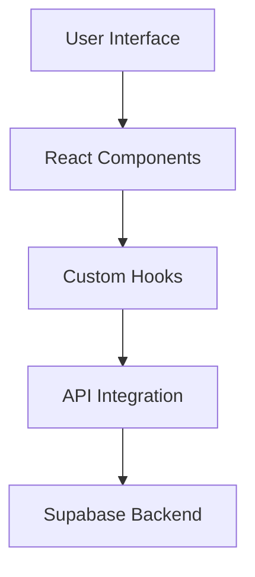

# Influencer Marketing Platform

A modern web application for connecting brands with influencers, managing campaigns, and tracking performance metrics.

## Project Overview

The Influencer Marketing Platform is a comprehensive solution that enables:
- Influencer discovery and filtering
- Detailed influencer profiles with analytics
- Pricing and package management
- Campaign booking and tracking
- Performance analytics and reporting

## Architecture

### Frontend Architecture

```
src/
├── components/           # Reusable UI components
│   ├── layout/          # Layout components (Header, Sidebar, etc.)
│   ├── ui/              # Base UI components
│   └── influencers/     # Influencer-specific components
├── hooks/               # Custom React hooks
├── integrations/        # Third-party integrations
├── pages/              # Page components
├── types/              # TypeScript type definitions
└── utils/              # Utility functions
```

### Key Components

1. **Layout Components**
   - `Header`: Main navigation and user controls
   - `Sidebar`: Secondary navigation
   - `Layout`: Page layout wrapper

2. **Influencer Components**
   - `InfluencerCard`: Displays influencer preview
   - `InfluencerProfile`: Detailed influencer information
   - `PricesTabContent`: Pricing and packages display
   - `ServicesTabContent`: Available services
   - `DataTabContent`: Analytics and metrics

3. **UI Components**
   - Button
   - Input
   - Select
   - Checkbox
   - Tabs
   - Avatar
   - Card

### Data Flow



## Technical Requirements

### Frontend
- React 18+
- TypeScript 5+
- TailwindCSS for styling
- Shadcn/ui for component library

### Backend (Supabase)
- PostgreSQL database
- Row Level Security (RLS)
- Real-time subscriptions
- Authentication & Authorization

### Development Environment
- Node.js 18+
- npm or yarn
- Git

## Database Schema

### Tables

1. **influencers**
```sql
CREATE TABLE influencers (
    id UUID PRIMARY KEY,
    name VARCHAR(255),
    username VARCHAR(255),
    bio TEXT,
    image_url TEXT,
    followers_instagram INT,
    followers_facebook INT,
    followers_twitter INT,
    followers_youtube INT,
    niche_id UUID REFERENCES niches(id),
    state_id UUID REFERENCES states(id),
    city_id UUID REFERENCES cities(id),
    created_at TIMESTAMP WITH TIME ZONE DEFAULT NOW(),
    updated_at TIMESTAMP WITH TIME ZONE DEFAULT NOW()
);
```

2. **pricing**
```sql
CREATE TABLE pricing (
    id UUID PRIMARY KEY,
    influencer_id UUID REFERENCES influencers(id),
    service_type VARCHAR(50),
    platform VARCHAR(50),
    price DECIMAL(10,2),
    is_active BOOLEAN DEFAULT true,
    created_at TIMESTAMP WITH TIME ZONE DEFAULT NOW()
);
```

## Development Guidelines

### Code Style

1. **TypeScript**
   - Use strict type checking
   - Define interfaces for all props
   - Use type inference when possible
   - Document complex types

2. **React**
   - Use functional components
   - Implement proper error boundaries
   - Use React.memo for optimization
   - Follow hooks best practices

3. **CSS/Tailwind**
   - Use utility classes
   - Create consistent spacing
   - Follow mobile-first approach
   - Maintain design system tokens

### Component Structure

```typescript
// Component template
import React from 'react';
import { ComponentProps } from './types';

export const Component: React.FC<ComponentProps> = ({
  prop1,
  prop2,
}) => {
  // State management
  
  // Effects
  
  // Event handlers
  
  // Render methods
  
  return (
    // JSX
  );
};
```

## Setup Instructions

1. **Clone the Repository**
```bash
git clone <repository-url>
cd <project-directory>
```

2. **Install Dependencies**
```bash
npm install
```

3. **Environment Setup**
```bash
cp .env.example .env.local
```
Edit `.env.local` with your configuration:
```
NEXT_PUBLIC_SUPABASE_URL=your_supabase_url
NEXT_PUBLIC_SUPABASE_ANON_KEY=your_supabase_key
```

4. **Run Development Server**
```bash
npm run dev
```

## Testing

1. **Unit Tests**
```bash
npm run test
```

2. **E2E Tests**
```bash
npm run test:e2e
```

## Deployment

1. **Build Application**
```bash
npm run build
```

2. **Production Deployment**
```bash
npm run start
```

## Security Considerations

1. **Authentication**
   - Implement JWT-based auth
   - Secure route protection
   - Session management

2. **Data Protection**
   - Input validation
   - XSS prevention
   - CSRF protection
   - Rate limiting

3. **API Security**
   - Request validation
   - Error handling
   - Logging
   - Monitoring

## Performance Optimization

1. **Frontend**
   - Code splitting
   - Lazy loading
   - Image optimization
   - Caching strategies

2. **Backend**
   - Query optimization
   - Connection pooling
   - Caching layer
   - Rate limiting

## Monitoring and Analytics

1. **Error Tracking**
   - Implement error boundaries
   - Log errors to monitoring service
   - Set up alerts

2. **Performance Monitoring**
   - Track page load times
   - Monitor API response times
   - Track user interactions

3. **Usage Analytics**
   - User engagement metrics
   - Feature usage tracking
   - Conversion tracking

## Contributing

1. Fork the repository
2. Create a feature branch
3. Commit your changes
4. Push to the branch
5. Create a Pull Request

## License

This project is licensed under the MIT License - see the LICENSE file for details.
